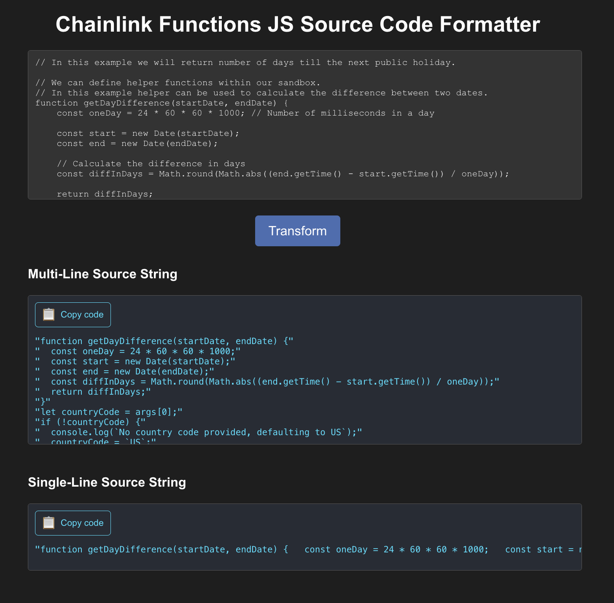

# Chainlink Functions JS Source Code Formatter UI

This app is deployed and available on Netlify at https://chainlink-functions-js-formatter.netlify.app.



For its functionality, it's consuming the [Chainlink Functions JS Source Code Formatter API](https://github.com/SyedAsadKazmi/Chainlink-Functions-JS-Source-Code-Formatter-API).


## Running Locally

If you want to run this app locally, then you can follow these steps:

1. Clone the Repository:

```bash
git clone https://github.com/SyedAsadKazmi/Chainlink-Functions-JS-Source-Code-Formatter-UI
cd Chainlink-Functions-JS-Source-Code-Formatter-UI
```

2. Install Dependencies: 

```bash
npm install
```

3. Start the app in the development mode:

```bash
npm start
```

The app will start and be available at http://localhost:3000.